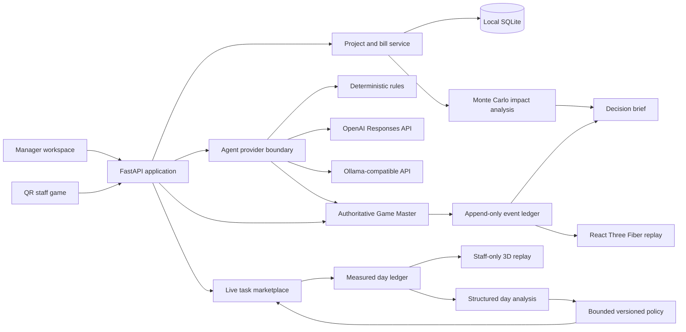

# Situational Awareness architecture

## System boundary

The Game Master is the only component allowed to mutate simulation state. The
Three.js scene is a read-only projection reconstructed from the event sequence;
moving the replay slider never sends an action back to the engine.

Provider implementations receive a bounded `AgentObservation` and return an
`AgentProposal`; they do not receive a mutable store object. The public proposal
schema permits only `move`, `operate_equipment`, `assist_customer`,
`remind_staff`, `wait`, or `exit`, an optional target/destination, a short public
rationale, and confidence. Provider-specific transport stays outside the Game
Master. The Game Master is the sole authority for permissions, state
transitions, arithmetic, and event logging.

The live staff game is a separate measured workflow from the synthetic paired
simulation. Its day ledger records real QR joins, task claims, releases,
completions, and derived points. The staff replay projects only those staff
events and deliberately renders no consumer agents. Closing a day creates a
structured analysis and an immutable policy version. Learned changes are
limited to `0.90x`–`1.10x` domain point weights and explainable task ranking;
role, zone, equipment, protected-load, and employment boundaries cannot be
changed by model output.

## Simulation tick

For each five-minute tick, the engine:

1. Builds bounded observations at meaningful consumer decision points.
2. Requests a provider proposal or an explicit deterministic fallback.
3. Validates movement, exit, role, occupancy, opening-hours, and equipment rules.
4. Applies accepted proposals and records rejected proposals.
5. Integrates energy used by the resulting equipment state.
6. Advances staff fatigue and workload after closing time.
7. Delivers a configured intervention nudge when scheduled.
8. Repeats the bounded proposal/validation path for eligible staff.

Random attempts use a stable draw keyed by seed, minute, agent, and action. This
keeps baseline and intervention comparisons paired: Green Close changes the
probability threshold, not the underlying random event.

## Evidence and uncertainty

| Kind | Examples | Interpretation |
|---|---|---|
| Measured | Confirmed bill kWh and cost | Observed input supplied by the operator |
| Derived | Effective tariff | Reproducible calculation from measured fields |
| Assumed | Equipment loads, operating days, grid factor | Editable model input requiring validation |
| Simulated | Behaviour, completion, after-hours state | Hypothesis generated by the agent model |

Each impact analysis runs matched baseline and intervention seeds. Equipment
load, tariff, adoption, and behaviour variation are propagated to P10, P50, and
P90 outputs. Profit-margin impact also uses the manager's editable annual-store-
revenue assumption. The bill calibrates the tariff only; whole-store usage is
never used to force-fit the closing-equipment model.

## Data and privacy

- SQLite stores projects, confirmed bill fields, simulation analyses, staff
  profiles, dated game ledgers, game analyses, and immutable learned policies.
- PDF/JSON/CSV/TXT uploads are limited to 5 MB and parsed in memory.
- Raw files are discarded and uploaded filenames are normalized before storage.
- Staff game links use random URL-safe join tokens. PINs use salted scrypt
  hashes and day-scoped bearer tokens are stored only as SHA-256 hashes. Staff
  endpoints expose only the authorized task market, own claims, and leaderboard.
- Simulation completion metrics and staff handoff use the same authorized-task
  function, which excludes protected loads and assignments outside role authority.
- Customer and staff agents use archetypes rather than real identities.
- Live game profiles are manager-configured identities and must be covered by a
  pilot privacy notice and retention policy before production deployment.
- Provider credentials are read from backend environment variables only. Safe
  provider fingerprints, model names, public rationales, usage, and latency may
  be persisted; secrets, raw prompts, and hidden reasoning are not.

## Extension points

New sustainability scenarios should add:

1. A typed intervention configuration in `backend/app/simulation/models.py`.
2. A scenario factory entry in `backend/app/simulation/scenarios.py`.
3. Game Master proposal and validation logic with explicit event data.
4. Paired-seed tests proving safety invariants and expected directional impact.
5. Frontend labels and an evidence statement that distinguishes assumptions
   from measured inputs.

## MVP limitations

- The demo represents one stylized 180 m² Singapore retail layout.
- Customer demand and staff behaviour are synthetic archetypes, not calibrated
  empirical populations.
- Energy analysis excludes demand charges, taxes, rebates, embodied carbon, and
  equipment degradation.
- Checklist tokens are suitable for a local pilot prototype; production should
  add user authentication, revocation, rate limits, audit identities, and a
  managed secrets/deployment strategy.
- Self-confirmed live tasks are engagement evidence, not verified resource
  savings. Production impact claims need equipment QR, manager, or sensor
  verification plus a documented retention and employee-use policy.
